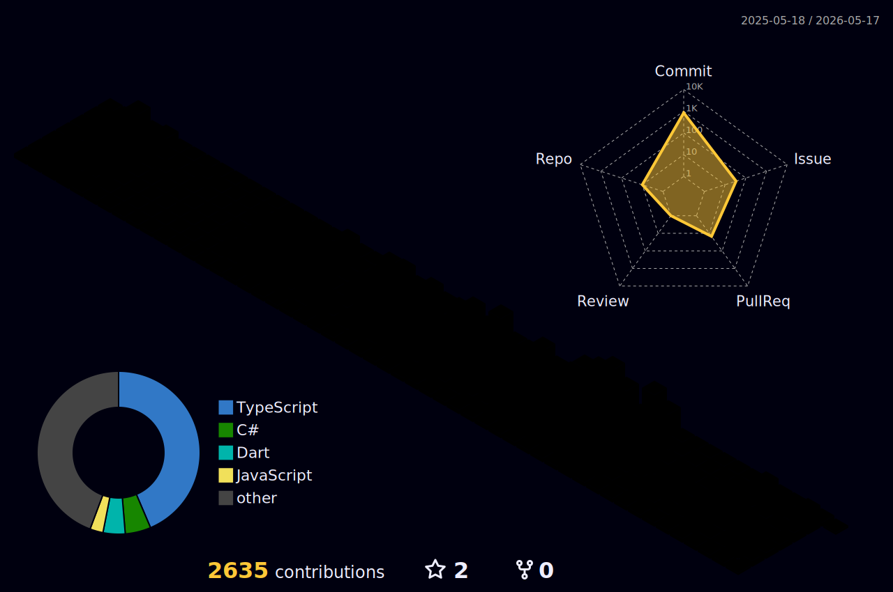

## 안녕하세요! 
모르는 것을 두려워하지 않고, 끊임없이 질문하며 성장하는 개발자, 양혜원입니다.

<!--

 

 

### ✏ My Storage
 

 

-->

<!--
<h3 align="center">🛠TECH STACK🛠</h3>

  </a>&nbsp 
  </a>&nbsp 
  </a>&nbsp 
  </a>&nbsp

<h3 align="center">📚ME📚</h3>

  &nbsp
  &nbsp
  

 
-->

<!--

<!--
**hyewon4052/hyewon4052** is a ✨ _special_ ✨ repository because its `README.md` (this file) appears on your GitHub profile.

Here are some ideas to get you started:

- 🔭 I’m currently working on ...
- 🌱 I’m currently learning ...
- 👯 I’m looking to collaborate on ...
- 🤔 I’m looking for help with ...
- 💬 Ask me about ...
- 📫 How to reach me: ...
- 😄 Pronouns: ...
- ⚡ Fun fact: ...
-->
